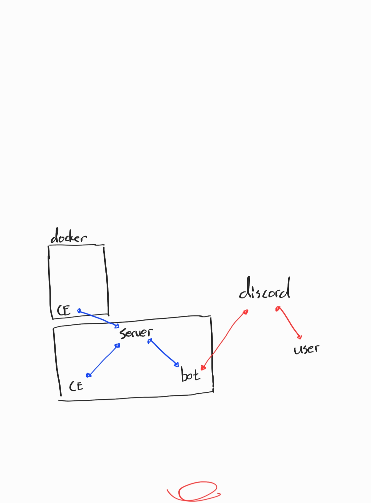
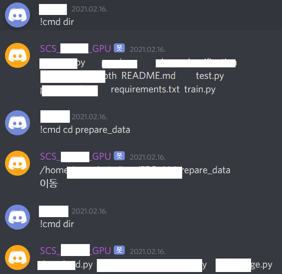
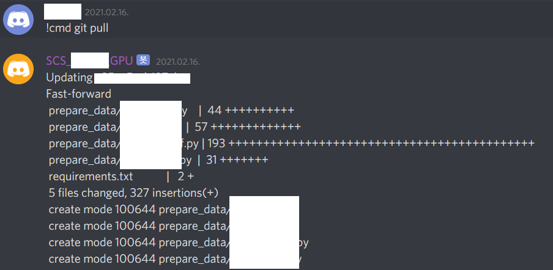

# SongsConsoleService

discord bot을 이용한 Linux Computer 제어  

  

Socket Communication을 이용해 명령 전달  


bot.py 디스코드에서 명령어를 받음 서버에게 명령어, CmdExcuter Name 전달  
Server.py 명령어 분배  
CmdExcuter.py 명령어 실행 후 서버에게 반환값 전달  

## Demo
  
  
[Demo Video](/demo)

## dependency
discord bot
```
pip install -U discord
```


## How To Use

edit bot.py  
TOKEN = 'YOUR TOKEN'  

```
python Server.py
python bot.py
python CmdExcuter.py -u CE1
```